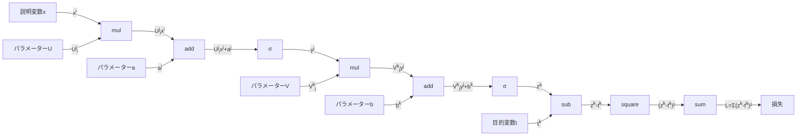
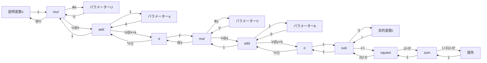

## 2層ニューラルネットワークの計算グラフ

## 全微分を書き込むと
機械学習なんて普通に最適化問題だから損失を最小化する目標で普通に勾配法したい
だからパラメーターどのくらい動かすか決めるので各パラメーターについてのLの偏微分が導出したい
てことでdLを全エッジについて書くと

```mermaid
graph LR
    %% 入力層
    data_x["説明変数x"] --> |"x<sup>i</sup>"| mul1["mul"]

    %% 1層目
    param_U["パラメーターU"] --> |"U<sup>j</sup><sub>i</sub>"| mul1
    mul1 --> |"U<sup>j</sup><sub>i</sub>x<sup>i</sup>"| add1["add"]
    param_a["パラメーターa"] --> |"a<sup>j</sup>"| add1
    add1 --> |"U<sup>j</sup><sub>i</sub>x<sup>i</sup>+a<sup>j</sup>"| act1["σ"]
    act1 --> |"y<sup>j</sup>"| mul2["mul"]
    
    %% 2層目
    param_V["パラメーターV"] --> |"V<sup>k</sup><sub>j</sub>"| mul2
    mul2 --> |"V<sup>k</sup><sub>j</sub>y<sup>j</sup>"| add2["add"]
    param_b["パラメーターb"] --> |"b<sup>k</sup>"| add2
    add2 --> |"V<sup>k</sup><sub>j</sub>y<sup>j</sup>+b<sup>k</sup>"| act2["σ"]
    act2 --> |"z<sup>k</sup>"| sub["sub"]
    
    %% 出力層
    data_t["目的変数t"] --> |"t<sup>k</sup>"| sub
    sub --> |"z<sup>k</sup>-t<sup>k</sup>"| square["square"]
    square --> |"(z<sup>k</sup>-t<sup>k</sup>)²"| sum["sum"]
    sum --> |"L=Σ(z<sup>k</sup>-t<sup>k</sup>)²"| loss["損失"]
    
    %% 逆伝播
    loss --> |dL| sum
    sum --> |"d(z<sup>k</sup>-t<sup>k</sup>)²"| square
    square --> |"2(z<sup>k</sup>-t<sup>k</sup>)d(z<sup>k</sup>-t<sup>k</sup>)"| sub
    sub --> |"2(z<sup>k</sup>-t<sup>k</sup>)dz<sup>k</sup>"| act2
    sub --> |"-2(z<sup>k</sup>-t<sup>k</sup>)dt<sup>k</sup>"| data_t
    act2 --> |"2(z<sup>k</sup>-t<sup>k</sup>)σ'()d(V<sup>k</sup><sub>j</sub>y<sup>j</sup>+b<sup>k</sup>)"| add2
    add2 --> |"2(z<sup>k</sup>-t<sup>k</sup>)σ'()d(b<sup>k</sup>)"| param_b
    add2 --> |"2(z<sup>k</sup>-t<sup>k</sup>)σ'()dV<sup>k</sup><sub>j</sub>y<sup>j</sup>"| mul2
    mul2 --> |"2(z<sup>k</sup>-t<sup>k</sup>)σ'()y<sup>j</sup>dV<sup>k</sup><sub>j</sub>"| param_V
    mul2 --> |"2(z<sup>k</sup>-t<sup>k</sup>)σ'()V<sup>k</sup><sub>j</sub>dy<sup>j</sup>"| act1
    act1 --> |"2(z<sup>k</sup>-t<sup>k</sup>)σ'()V<sup>k</sup><sub>j</sub>σ'()d(U<sup>j</sup><sub>i</sub>x<sup>i</sup>+a<sup>j</sup>)"| add1
    add1 --> |"2(z<sup>k</sup>-t<sup>k</sup>)σ'()V<sup>k</sup><sub>j</sub>σ'()da<sup>j</sup>"| param_a
    add1 --> |"2(z<sup>k</sup>-t<sup>k</sup>)σ'()V<sup>k</sup><sub>j</sub>σ'()dU<sup>j</sup><sub>i</sub>x<sup>i</sup>"| mul1
    mul1 --> |"2(z<sup>k</sup>-t<sup>k</sup>)σ'()V<sup>k</sup><sub>j</sub>σ'()x<sup>i</sup>dU<sup>j</sup><sub>i</sub>"| param_U
    mul1 --> |"2(z<sup>k</sup>-t<sup>k</sup>)σ'()V<sup>k</sup><sub>j</sub>σ'()U<sup>j</sup><sub>i</sub>dx<sup>i</sup>"| data_x
```

## numpyの演算として表現
こんなんnumpyにあるレベルの2次元配列演算で表現できるよね

```mermaid
graph LR
    %% 入力層
    data_x["説明変数x"] --> |"x"| mul1["mul"]

    %% 1層目
    param_U["パラメーターU"] --> |"U"| mul1
    mul1 --> |"U@x"| add1["add"]
    param_a["パラメーターa"] --> |"a"| add1
    add1 --> |"U@x+a"| act1["σ"]
    act1 --> |"y"| mul2["mul"]
    
    %% 2層目
    param_V["パラメーターV"] --> |"V"| mul2
    mul2 --> |"V@y"| add2["add"]
    param_b["パラメーターb"] --> |"b"| add2
    add2 --> |"V@y+b"| act2["σ"]
    act2 --> |"z"| sub["sub"]
    
    %% 出力層
    data_t["目的変数t"] --> |"t"| sub
    sub --> |"z-t"| square["square"]
    square --> |"(z-t)²"| sum["sum"]
    sum --> |"L=Σ(z-t)²"| loss["損失"]
    
    %% 逆伝播
    loss --> |1| sum
    sum --> |1| square
    square --> |"2(z-t)"| sub
    sub --> |"2(z-t)"| act2
    sub --> |"-2(z-t)"| data_t
    act2 --> |"2(z-t)#42;σ'()"| add2
    add2 --> |"2(z-t)#42;σ'()"| param_b
    add2 --> |"2(z-t)#42;σ'()"| mul2
    mul2 --> |"2(z-t)#42;σ'()⊗y"| param_V
    mul2 --> |"2(z-t)#42;σ'()#42;V@y"| act1
    act1 --> |"2(z-t)#42;σ'()#42;V@y#42;σ'()"| add1
    add1 --> |"2(z-t)#42;σ'()#42;V@y#42;σ'()"| param_a
    add1 --> |"2(z-t)#42;σ'()#42;V@y#42;σ'()"| mul1
    mul1 --> |"2(z-t)#42;σ'()#42;V@y#42;σ'()⊗x"| param_U
    mul1 --> |"2(z-t)#42;σ'()#42;V@y#42;σ'()@U"| data_x
```

## 自動微分
なんと損失からのパスで拾っていくことにすればこう書ける

これを自動微分まで書いた計算グラフといいます
この自動微分の実際の値、普通に右から計算したいよね てことで誤差逆伝播法と呼びます
これをtensorflowやpytorchは自動でしてくれます