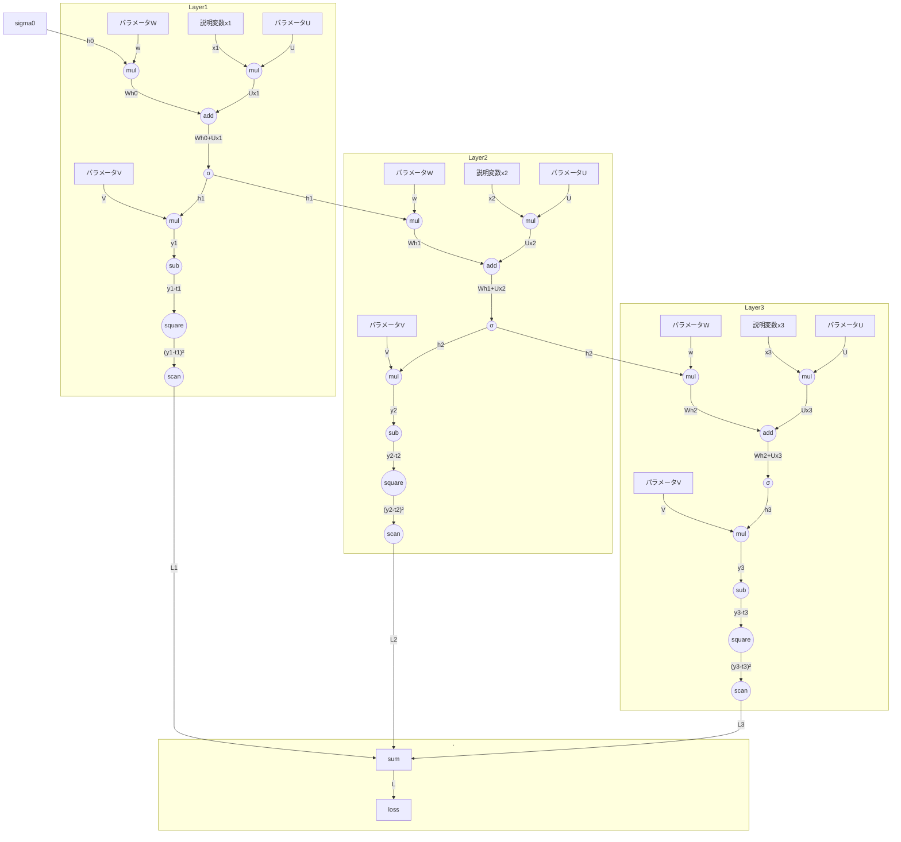

## 
RNN = Recurrent Neural Network

## RNNの計算グラフ

```mermaid
flowchart TD

  %% 損失ノード
  subgraph .
    sum -->|L| loss
  end
  
  sigma0 -->|h0| mula1

  %% Layer1
  subgraph Layer1
    ParamW1["パラメータW"] -->|w| mula1((mul))
    mula1 -->|Wh0| adda1((add))
    X1["説明変数x1"] -->|x1| mulb1((mul))
    ParamU1["パラメータU"] -->|U| mulb1
    mulb1 -->|Ux1| adda1
    adda1 -->|Wh0+Ux1| sigma1((σ))
    ParamV1["パラメータV"] -->|V| mulc1
    sigma1 -->|h1| mulc1((mul))
    mulc1 -->|y1| sub1((sub))
    sub1 -->|y1-t1| sq1((square))
    sq1 -->|"(y1-t1)²"| scan1((scan))
    scan1 -->|L1| sum
  end

  sigma1 -->|h1| mula2

  %% Layer2
  subgraph Layer2
    ParamW2["パラメータW"] -->|w| mula2((mul))
    mula2 -->|Wh1| adda2((add))
    X2["説明変数x2"] -->|x2| mulb2((mul))
    ParamU2["パラメータU"] -->|U| mulb2
    mulb2 -->|Ux2| adda2
    adda2 -->|Wh1+Ux2| sigma2((σ))
    ParamV2["パラメータV"] -->|V| mulc2
    sigma2 -->|h2| mulc2((mul))
    mulc2 -->|y2| sub2((sub))
    sub2 -->|y2-t2| sq2((square))
    sq2 -->|"(y2-t2)²"| scan2((scan))
    scan2 -->|L2| sum
  end

  sigma2 -->|h2| mula3

  %% Layer3
  subgraph Layer3
    ParamW3["パラメータW"] -->|w| mula3((mul))
    mula3 -->|Wh2| adda3((add))
    X3["説明変数x3"] -->|x3| mulb3((mul))
    ParamU3["パラメータU"] -->|U| mulb3
    mulb3 -->|Ux3| adda3
    adda3 -->|Wh2+Ux3| sigma3((σ))
    ParamV3["パラメータV"] -->|V| mulc3
    sigma3 -->|h3| mulc3((mul))
    mulc3 -->|y3| sub3((sub))
    sub3 -->|y3-t3| sq3((square))
    sq3 -->|"(y3-t3)²"| scan3((scan))
    scan3 -->|L3| sum
  end

```