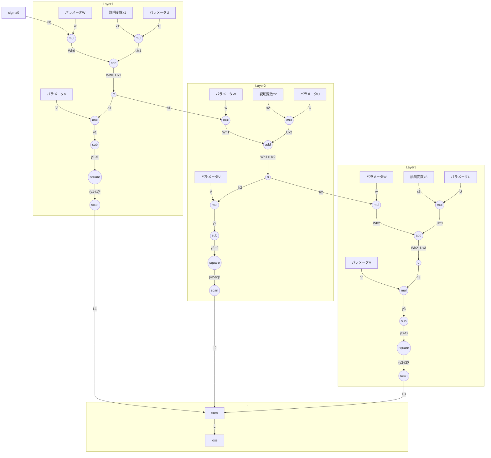

## 
RNN = Recurrent Neural Network

## RNNの計算グラフ## 
RNN = Recurrent Neural Network

## RNNの計算グラフ



## RNNの誤差逆伝播のグラフ
```mermaid
flowchart TD

  %% 損失ノード
  subgraph .
    loss -->|1| sum
  end
  
  mula1 -->|@W| sigma0

  %% Layer1
  subgraph Layer1
    mula1((mul)) -->|⊗h0| ParamW1["パラメータW"]
    adda1((add)) -->|1| mula1
    mulb1((mul)) -->|@U| X1["説明変数x1"]
    mulb1 -->|⊗x1| ParamU1["パラメータU"]
    adda1 -->|1| mulb1
    sigma1((σ)) -->|σ'| adda1
    mulc1 -->|⊗h0| ParamV1["パラメータV"]
    mulc1((mul)) -->|@V| sigma1
    sub1((sub)) -->|1| mulc1
    sq1((square)) -->|"2(y1-t1)"| sub1
    scan1((scan)) -->|1| sq1
    sum -->|1| scan1
  end

  mula2 -->|@W| sigma1

  %% Layer2
  subgraph Layer2
    mula2((mul)) -->|⊗h0| ParamW2["パラメータW"]
    adda2((add)) -->|1| mula2
    mulb2((mul)) -->|@U| X2["説明変数x2"]
    mulb2 -->|⊗x2| ParamU2["パラメータU"]
    adda2 -->|1| mulb2
    sigma2((σ)) -->|σ'| adda2
    mulc2 -->|⊗h0| ParamV2["パラメータV"]
    mulc2((mul)) -->|@V| sigma2
    sub2((sub)) -->|1| mulc2
    sq2((square)) -->|"2(y2-t2)"| sub2
    scan2((scan)) -->|1| sq2
    sum -->|1| scan2
  end

  mula3 -->|@W| sigma2

  %% Layer3
  subgraph Layer3
    mula3((mul)) -->|⊗h0| ParamW3["パラメータW"]
    adda3((add)) -->|1| mula3
    mulb3((mul)) -->|@U| X3["説明変数x3"]
    mulb3 -->|⊗x3| ParamU3["パラメータU"]
    adda3 -->|1| mulb3
    sigma3((σ)) -->|σ'| adda3
    mulc3 -->|⊗h0| ParamV3["パラメータV"]
    mulc3((mul)) -->|@V| sigma3
    sub3((sub)) -->|1| mulc3
    sq3((square)) -->|"2(y3-t3)"| sub3
    scan3((scan)) -->|1| sq3
    sum -->|1| scan3
  end

```