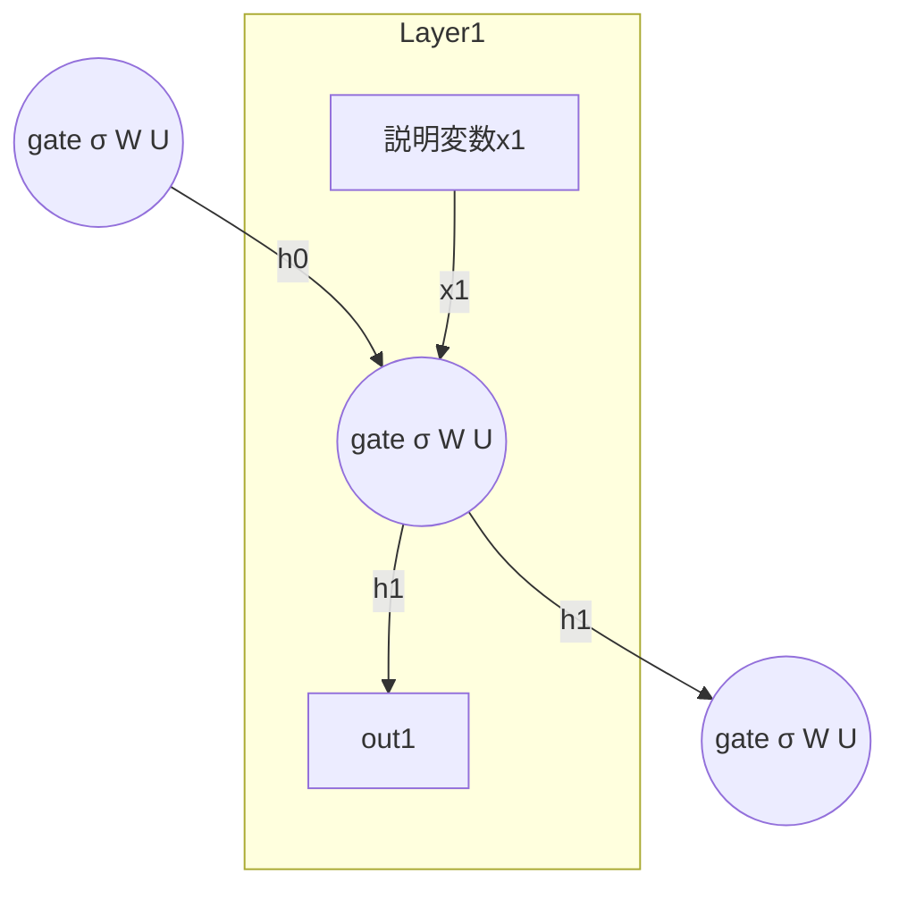

## RNNの計算グラフ
RNN = Recurrent Neural Network
最も簡単な例のRNNの計算グラフを示します

```mermaid
flowchart TD

  %% 損失ノード
  subgraph .
    sum -->|L| loss
  end
  
  sigma0 -->|h0| mula1

  %% Layer1
  subgraph Layer1
    ParamW1["パラメータW"] -->|W| mula1((@))
    mula1 -->|Wh0| adda1((add))
    X1["説明変数x1"] -->|x1| mulb1((@))
    ParamU1["パラメータU"] -->|U| mulb1
    mulb1 -->|Ux1| adda1
    adda1 -->|Wh0+Ux1| sigma1((σ))
    ParamV1["パラメータV"] -->|V| mulc1
    sigma1 -->|h1| mulc1((@))
    mulc1 -->|y1| sub1((sub))
    sub1 -->|y1-t1| sq1((square))
    sq1 -->|"(y1-t1)²"| scan1((scan))
    scan1 -->|L1| sum
  end

  sigma1 -->|h1| mula2

  %% Layer2
  subgraph Layer2
    ParamW2["パラメータW"] -->|W| mula2((@))
    mula2 -->|Wh1| adda2((add))
    X2["説明変数x2"] -->|x2| mulb2((@))
    ParamU2["パラメータU"] -->|U| mulb2
    mulb2 -->|Ux2| adda2
    adda2 -->|Wh1+Ux2| sigma2((σ))
    ParamV2["パラメータV"] -->|V| mulc2
    sigma2 -->|h2| mulc2((@))
    mulc2 -->|y2| sub2((sub))
    sub2 -->|y2-t2| sq2((square))
    sq2 -->|"(y2-t2)²"| scan2((scan))
    scan2 -->|L2| sum
  end

  sigma2 -->|h2| mula3

  %% Layer3
  subgraph Layer3
    ParamW3["パラメータW"] -->|W| mula3((@))
    mula3 -->|Wh2| adda3((add))
    X3["説明変数x3"] -->|x3| mulb3((@))
    ParamU3["パラメータU"] -->|U| mulb3
    mulb3 -->|Ux3| adda3
    adda3 -->|Wh2+Ux3| sigma3((σ))
    ParamV3["パラメータV"] -->|V| mulc3
    sigma3 -->|h3| mulc3((@))
    mulc3 -->|y3| sub3((sub))
    sub3 -->|y3-t3| sq3((square))
    sq3 -->|"(y3-t3)²"| scan3((scan))
    scan3 -->|L3| sum
  end

```


## RNNの誤差逆伝播のグラフ
```mermaid
flowchart TD

  %% 損失ノード
  subgraph .
    loss -->|1| sum
  end
  
  mula1 -->|@W| sigma0

  %% Layer1
  subgraph Layer1
    mula1((@)) -->|⊗h0| ParamW1["パラメータW"]
    adda1((add)) -->|1| mula1
    mulb1((@)) -->|@U| X1["説明変数x1"]
    mulb1 -->|⊗x1| ParamU1["パラメータU"]
    adda1 -->|1| mulb1
    sigma1((σ)) -->|σ'| adda1
    mulc1 -->|⊗h0| ParamV1["パラメータV"]
    mulc1((@)) -->|@V| sigma1
    sub1((sub)) -->|1| mulc1
    sq1((square)) -->|"2(y1-t1)"| sub1
    scan1((scan)) -->|1| sq1
    sum -->|1| scan1
  end

  mula2 -->|@W| sigma1

  %% Layer2
  subgraph Layer2
    mula2((@)) -->|⊗h0| ParamW2["パラメータW"]
    adda2((add)) -->|1| mula2
    mulb2((@)) -->|@U| X2["説明変数x2"]
    mulb2 -->|⊗x2| ParamU2["パラメータU"]
    adda2 -->|1| mulb2
    sigma2((σ)) -->|σ'| adda2
    mulc2 -->|⊗h0| ParamV2["パラメータV"]
    mulc2((@)) -->|@V| sigma2
    sub2((sub)) -->|1| mulc2
    sq2((square)) -->|"2(y2-t2)"| sub2
    scan2((scan)) -->|1| sq2
    sum -->|1| scan2
  end

  mula3 -->|@W| sigma2

  %% Layer3
  subgraph Layer3
    mula3((@)) -->|⊗h0| ParamW3["パラメータW"]
    adda3((add)) -->|1| mula3
    mulb3((@)) -->|@U| X3["説明変数x3"]
    mulb3 -->|⊗x3| ParamU3["パラメータU"]
    adda3 -->|1| mulb3
    sigma3((σ)) -->|σ'| adda3
    mulc3 -->|⊗h0| ParamV3["パラメータV"]
    mulc3((@)) -->|@V| sigma3
    sub3((sub)) -->|1| mulc3
    sq3((square)) -->|"2(y3-t3)"| sub3
    scan3((scan)) -->|1| sq3
    sum -->|1| scan3
  end

```

## RNNの各パラメータの誤差逆伝播の計算式
したがって、以下の勾配が得られます：

$$
\begin{align*}
\frac{\partial L}{\partial V} &= 2(y_1-t_1)\otimes h_1 + 2(y_2-t_2)\otimes h_2 + 2(y_3-t_3)\otimes h_3 + \cdots \\
\frac{\partial L}{\partial (Wh_0+Ux_1)} &= 2(y_1-t_1)@ V*\sigma'_1 + 2(y_2-t_2)@ V*\sigma'_2@ W*\sigma'_1 + 2(y_3-t_3)@ V*\sigma'_3@ W*\sigma'_2@ W*\sigma'_1 + \cdots \\
\frac{\partial L}{\partial W} &= \left(\frac{\partial L}{\partial (Wh_0+Ux_1)}\right)\otimes h_0 + \left(\frac{\partial L}{\partial (Wh_1+Ux_2)}\right)\otimes h_1 + \left(\frac{\partial L}{\partial (Wh_2+Ux_3)}\right)\otimes h_2 + \cdots \\
\frac{\partial L}{\partial U} &= \left(\frac{\partial L}{\partial (Wh_0+Ux_1)}\right)\otimes x_1 + \left(\frac{\partial L}{\partial (Wh_1+Ux_2)}\right)\otimes x_2 + \left(\frac{\partial L}{\partial (Wh_2+Ux_3)}\right)\otimes x_3 + \cdots
\end{align*}
$$

ここで、$\otimes$ は直積を、$*$ はアダマール積を、$@$ は行列積を表します。

でもこれはやばいことがわかる。
もし$\sigma$に$\tanh$を使ったなら、$\sigma'$は$0$に近い項であることが多すぎて、べき乗したら小さくなりすぎて逆伝播なんて計算できない。(勾配消失問題)
一方$\sigma$にReLUを使ったなら、いたるところ$\sigma'$は$1$なのだが、これもやばい。
というのも$\frac{\partial L}{\partial (Wh_0+Ux_1)}$の第$t$項は$W^t$かかってる。もし$||W||>1$とすると古い項ほど影響が大きくなるので、そんなわけなくて$||W||<1$なんだけど、それはそれで古い項の影響がべき乗で小さくなりすぎる、例えば$||W||\sim0.8$くらいでも$t\sim20$くらいで$||W^t||\sim0.01$となりほぼ覚えてないことになる。
これが理由でシンプルなRNNでは10～20項くらいで記憶力の限界になる。
べき乗なのがどうもね


## RNNセル
```mermaid
flowchart TD
  sigma0(sigma0) -->|h0| mula1

  %% Layer1
  subgraph Layer1
    ParamW1["パラメータW"] -->|W| mula1((@))
    mula1 -->|Wh0| adda1((add))
    X1["説明変数x1"] -->|x1| mulb1((@))
    ParamU1["パラメータU"] -->|U| mulb1
    mulb1 -->|Ux1| adda1
    adda1 -->|Wh0+Ux1| sigma1((σ))
    sigma1 -->|h1| out1
  end

  sigma1 -->|h1| mula2((@))
```
の部分をRNNセルといい、

と略します。これの逆伝播グラフは以下のようになります。
```mermaid
flowchart TD
  gate2((gate σ W U)) -->|σ'@W| gate1

  %% Layer1
  subgraph Layer1
    gate1((gate σ W U)) -->|σ'@U| X1["説明変数x1"]
    out1 -->|"...@V"| gate1
  end

  gate1 -->|σ'@W| gate0((gate σ W U))

```

## LSTMセル
ということで、人間の記憶力って短期記憶(脳科学的な短期記憶に等しいとは限らない。言語モデルでいえばさっき書いた主語が男性名詞だから述語の性も男性にしなきゃレベルの短期)はべき乗で減衰していいけど長期記憶はそうじゃないよねってことで開発されたのがLSTM(Long Short Time Memory)。
$c$が長期記憶で$h$が隠れ状態(短期記憶)。
$f$は長期記憶忘却ゲート($1$が維持、$0$が忘却）。
$i$は長期記憶入力ゲート($1$が追加、$0$が棄却）。
$\tilde{c}$は長期記憶追加候補。
$o$は隠れ状態出力ゲート。
![[S__4489218.jpg]]

このセルをセルとしたネットワークで$h_{10}$から$f_1$への逆伝播パスを考えると11通りあるわけだけど、
そのうちずっと下の道通ってるパスは
$$*\tanh(c_{10}) *\sigma' @ W_o *\tanh(c_9) *\sigma' @ W_o * \cdots$$
となってシンプルなRNNと同様に減衰して消えてしまうが、
上の道通ってるパスは
$$*o_{10} *\tanh'(c_{10}) *f_{10} *f_9 *f_8 *\cdots *f_2 *c_1$$
となって、この$f$というのは忘れたいか維持したいかの0/1のbitみたいなもんだから、ずっと1ならちゃんと維持するし、一度0になればちゃんと忘れる効果を発揮する。
実際やってみるとちゃんと長期記憶できてて感動します。